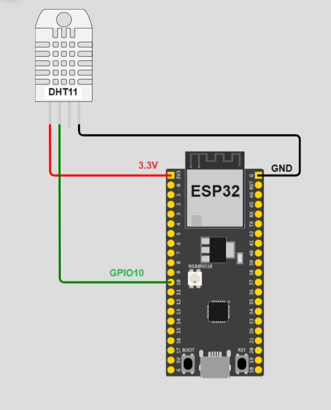
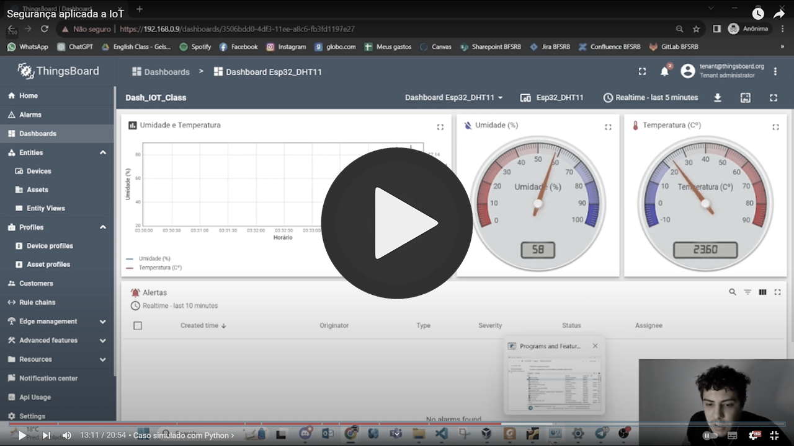

# IoT-CyberSec-Thingsboard-ESP32

This repository contains the code and documentation related to the Cybersecurity project in the Internet of Things domain as part of the Specialization in Cybersecurity at FACENS University Center in Sorocaba, São Paulo, Brazil. The project involves implementing an IoT device that sends temperature and humidity sensor data via MQTTS to the Thingsboard platform with HTTPS-configured interface. Two solutions were developed: a simulated case (in Python) and a real case (using ESP32+DHT11 programmed in C++ with PlatformIO). A Docker container installed on a Linux-based virtual machine was used as the project environment. A custom dashboard and configuration for alarms and notifications via Telegram in case of temperature anomalies were also implemented on the broker.

## People involved
- Author: Engineer Filipe Sousa
- Author: Engineer Gelson Filho
- Advisor: Engineer Master Leandro Avanço

## Objectives
This project aims to demonstrate the knowledge acquired in the Applied IoT Security discipline, considering the following topics:

- Installation and configuration of the Thingsboard platform.
- Programming a simulated IoT device to send temperature and humidity data.
- Implementation of HTTPS protocol on the standard Thingsboard web interface.
- Implementation of secure MQTT communication.
- Evaluation of Docker container reconfigurations to use secure communication ports.
- Device programming for communication on secure ports.
- Creation of alarm rules in Thingsboard.
- Telegram notification in case of alarms.

## Development
This project was developed in several stages, including:

1. Installation of the Thingsboard platform via Docker container on a virtual machine (VM).
2. Programming a Python-based IoT device simulator to send temperature and humidity data.
3. Programming an ESP32 + DHT11 to demonstrate a real data sending scenario.
3. Implementation of HTTPS protocol for secure communication with Thingsboard.
4. Configuration of secure communication for the MQTT protocol.
5. Creation of alarm rules in Thingsboard to notify specific events.
6. Configuration of Telegram notifications for alarm alerts.

## Execution
To run this project, follow the detailed steps in the [complete documentation](https://github.com/GelsonFilho/IoT-CyberSec-Thingsboard-ESP32/blob/main/FinalReport/Trabalho_IoT_Filipe_Gelson.pdf) available in this repository.

## Project Components
### Rule Chains and Dashboard exported from Thingsboard: [Json exported](Exported)
### Docker Configuration: [Docker compose](Docker)
### Certificates: [Keys](Keys)
### Simulated Python Version: [Simulated Case](SimulatedCase)
### Real Version with ESP32+DHT11: [Real Case](RealCase)
### Official Project Document (in Portuguese): [Final Report](FinalReport)
### Circuit of the real version: 

### Project Presentation Video (in Portuguese): 

## Credits
- [Thingsboard Documentation](https://thingsboard.io/docs/): Documentation of the open-source IoT Platform used in this project.
- [Telegram Bot API](https://core.telegram.org/bots): Documentation for creating a bot for integration with Telegram.
- [Debashish Sahu's GitHub](https://github.com/debsahu/ESP_MQTT_Secure): A working implementation of SSL certificate-based MQTT communication for ESP32 in PlatformIO.

---

**Note**: This README is a summarized version of the project. Refer to the [complete documentation](https://github.com/GelsonFilho/IoT-CyberSec-Thingsboard-ESP32/blob/main/FinalReport/Trabalho_IoT_Filipe_Gelson.pdf) for detailed information and installation instructions.
